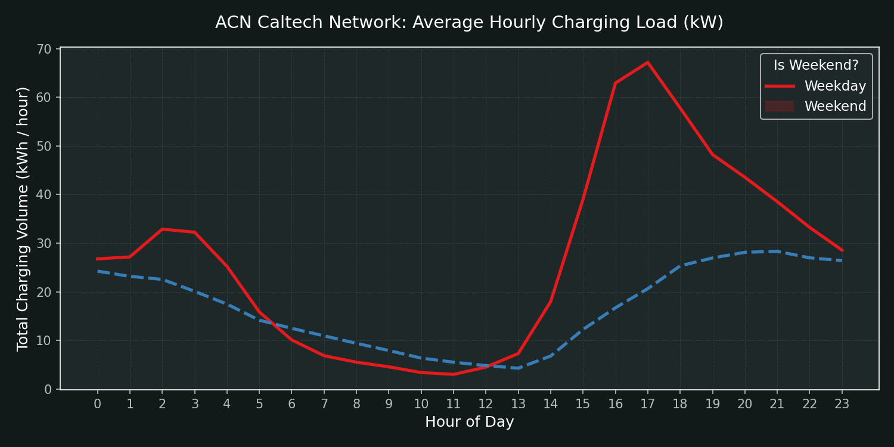
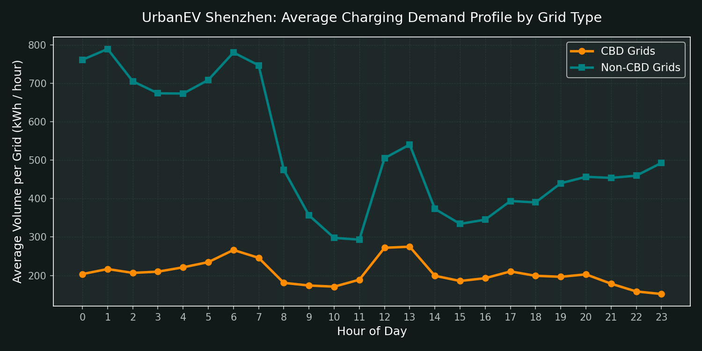
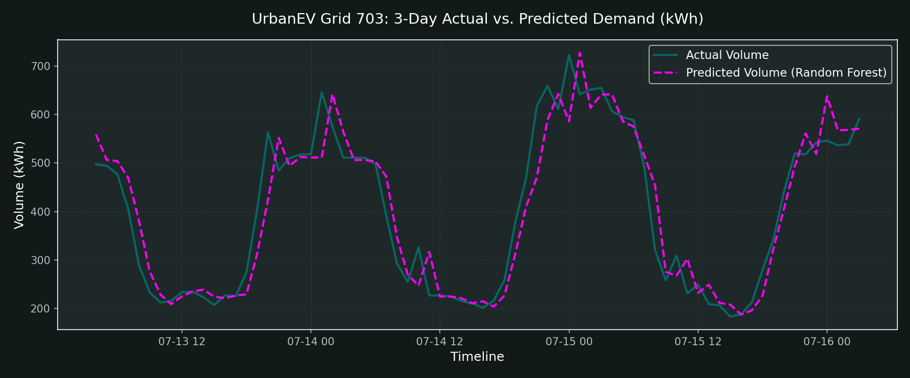
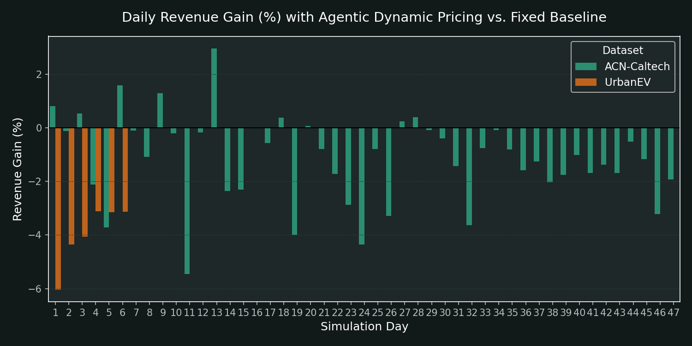
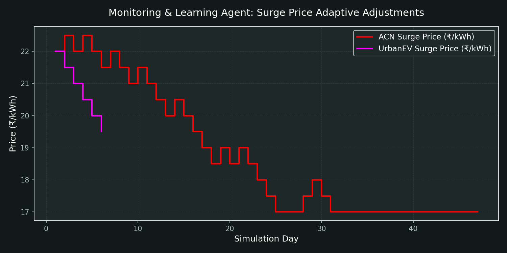

# Agentic AI-Based Dynamic Tariff Optimization
> **Self-Improving Pricing Models for EV Charging Infrastructure**  
> *Society of Business | Open Project 2026 Submission*

This repository implements an end-to-end reproducible data science and reinforcement-learning-style feedback pipeline for optimizing Electric Vehicle (EV) charging tariffs. It leverages machine learning to predict charging demand and grid congestion, and utilizes an adaptive pricing agent to dynamically adjust tariffs—optimizing revenue for Charge Point Operators (CPOs) while mitigating grid load and queue times.

---

## Project Overview

As EV adoption grows, charging infrastructure faces two major challenges:
1. **Severe Grid Congestion & High Wait Times** during peak charging hours.
2. **Underutilization** during off-peak hours (e.g., midnight to early morning).

This project designs a **Dual-Agent Architecture** to address these challenges:
- **Demand Prediction Agent**: A machine learning model (Random Forest Regressor & Classifier) that predicts hourly charging volume, charger utilization, and congestion risks.
- **Dynamic Tariff Agent**: A rule-based pricing policy with a **Closed-Loop Feedback Mechanism** that dynamically shifts prices (Surge, Standard, Discount) based on predicted demand, and adjusts its pricing thresholds daily based on historical feedback.

---

## Dataset Landscape

The pipeline processes and analyzes two distinct EV charging datasets to validate model generalizability:

1. **ACN-Caltech Dataset**  
   - **Type**: Workplace charging sessions.
   - **Granularity**: Session-level logs containing 14,999 charging events (mapped to hourly station timelines).
   - **Scale**: 54 charging stations (303,858 station-hours).
   
2. **UrbanEV Dataset (Shenzhen)**  
   - **Type**: Urban municipal fleet/public charging network.
   - **Granularity**: 5-minute telemetry aggregated to hourly averages.
   - **Scale**: 247 grid zones containing 24,798 charging piles total (171,912 grid-hours).

---

## Machine Learning & Architecture

### 1. Feature Engineering
We extract the following features from the temporal and spatial datasets:
- **Seasonality**: Hour of day, day of week, weekend flags, and month.
- **Lags**: Immediate historical demand (`vol_lag1`, `vol_lag2`) and diurnal seasonality (`vol_lag24`).
- **Procurement Cost**: Time-of-Use (ToU) electricity cost structure (₹6/kWh off-peak, ₹9/kWh shoulder, ₹12/kWh peak).
- **Congestion & Queue Proxies**: Estimated wait times based on capacity utilization.
- **Spatial Attributes** (UrbanEV only): Latitude/longitude, Central Business District (CBD) status, fast/slow charger counts.

### 2. Model Performance
Models are trained chronologically (80% train, 20% test) to prevent data leakage. The results show high predictive accuracy:

| Dataset | Volume $R^2$ | Volume RMSE | Utilization $R^2$ | Congestion Accuracy | Congestion AUC |
| :--- | :---: | :---: | :---: | :---: | :---: |
| **ACN-Caltech** | `0.6994` | `0.5738` | `0.7698` | `96.56%` | `97.84%` |
| **UrbanEV** | `0.9767` | `192.5270` | `0.9450` | `99.83%` | `99.93%` |

*Note: Congestion is defined as hourly charger utilization exceeding 80%.*

---

## Dynamic Tariff & Learning Feedback Loop

The pricing policy operates on three levels relative to predicted utilization:
* **Surge Pricing (₹22/kWh initial)**: Triggered when predicted utilization $\ge$ 80% to throttle peak demand.
* **Discount Pricing (₹10/kWh initial)**: Triggered when predicted utilization $\le$ 30% to attract off-peak charging.
* **Standard Pricing (₹15/kWh fixed)**: Applied in normal conditions.

### Closed-Loop Learning
At the end of each simulated day, the **Monitoring Agent** evaluates the outcome:
- **If Peak Congestion is Reduced**: Surge price is incrementally raised (up to ₹25/kWh) to capture more revenue.
- **If Peak Congestion persists**: Surge price is adjusted downwards to find the demand-response equilibrium.
- **If Off-Peak Uplift is Weak**: The discount is deepened (down to ₹7/kWh) to stimulate price-sensitive demand.

---

## Repository Structure

```directory
SocBiz/
│
├── Datasets OP'26 Analytics-.../      # Raw input datasets (XLSX, CSV)
│
├── processed_acn/                     # Processed ACN timeseries outputs
├── processed_urbanev/                 # Processed UrbanEV timeseries outputs
│
├── plots/                             # Saved analytical visualizations
│   ├── eda_acn_demand.png
│   ├── eda_urbanev_demand.png
│   ├── model_predictions_acn.png
│   ├── model_predictions_urbanev.png
│   ├── pricing_feedback_loop.png
│   ├── pricing_outcomes_revenue.png
│   ├── pricing_outcomes_grid_metrics.png
│   └── pricing_sensitivity_analysis.png
│
├── data_prep.py                       # Preprocessing and alignment script
├── demand_agent.py                    # Trains Random Forests & outputs predictions
├── pricing_agent.py                   # Simulates dynamic tariff & sensitivity checks
├── plot_generator.py                  # Generates all visual figures
├── generate_deck.py                   # Creates PPTX presentation using python-pptx
├── run_all.py                         # One-click reproducible execution script
│
├── requirements.txt                   # Python packages required
├── LICENSE                            # MIT License
└── README.md                          # Documentation (this file)
```

---

## Installation & Execution

### Prerequisites
Make sure Python 3.8+ is installed on your system.

1. Clone or download this repository:
   ```bash
   git clone https://github.com/Samruddhi2305/SocBiz.git
   cd SocBiz
   ```

2. Install the required Python packages:
   ```bash
   pip install -r requirements.txt
   ```

3. Run the entire end-to-end pipeline:
   ```bash
   python run_all.py
   ```

Running `run_all.py` will execute the stages sequentially, outputting logs and saving the analytical deliverables directly into the workspace root.

---

## Analytical Deliverables & Visuals

The pipeline generates high-quality dark-themed plots (saved in `plots/`) ready for presentation:

### 1. Demand Patterns (EDA)
Reveals diurnal curves and spatial patterns (e.g., ACN's morning work peaks vs. UrbanEV's afternoon/evening delivery fleet peaks).
* 
* 

### 2. Prediction Fit
Compares actual volumes against Random Forest predictions over a 3-day holdout set.
* 

### 3. Pricing & Optimization Metrics
Tracks daily revenue changes and queue reductions as the pricing agent adapts its surge/discount thresholds.
* 
* 

---

## Slide Deck Presentation
The pipeline compiles all analytical figures and key business takeaways into a PowerPoint file:
**`presentation_deck.pptx`**

The presentation is stylized under the premium **"Operational Prestige '26"** dark-slate and emerald-green theme and covers:
1. Data Preprocessing & Alignment Table
2. Exploratory Data Analysis Insights
3. Machine Learning Forecasting Accuracy
4. Dynamic Tariff Agent Outcomes
5. Closed-loop Feedback Loop Dynamics
6. Business & Strategic Implications for CPOs (Capacity investment, dual-objective optimization, policy insights)
7. Appendix: Robustness Checks & Sensitivity analysis across multiple elasticity scenarios.
